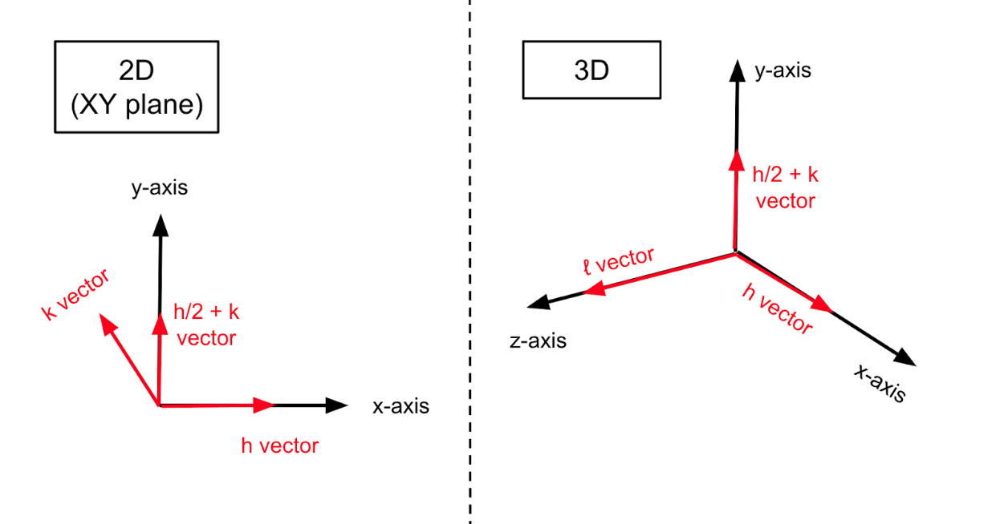

# Graphene-Silicene Bilayer

This tutorial is an introduction to the domain-specific language for
prototyping crystal geometries. It shows how the 3D geometry compiler can
be used to create 2D shapes. Restriction to 3D shapes was one important design 
choice for the compiler. By supporting only the minimal amount of needed
functionality, the language is simpler and the compiler takes less effort to
develop. If the user wishes to work with an unsupported crystal geometry, they
can easily generate it from a supported geometry. In this case, an unsupported 
"planar" lattice is created from a "hexagonal" lattice.

Objective: reproduce the graphene-silicene bilayer from https://doi.org/10.1103/PhysRevB.88.245408

## Setup

To use this tutorial, you need to download Swift and set up an IDE. The
easiest method, especially on Windows, is through Visual Studio Code.
Install the Swift extension for VS Code and create a new project.
Add the external package https://github.com/philipturner/HDL and type the
following in `main.swift`. The code should compile without errors.

```swift
import HDL

func exportToXYZ(_ entities: [Entity]) -> String {
  var output: String = ""
  for entity in entities {
    guard case .atom(let element) = entity.type else {
      fatalError("Cannot export entities other than atoms.")
    }
    var elementSymbol: String
    switch element {
    case .hydrogen: elementSymbol = "H "
    case .carbon: elementSymbol = "C "
    case .silicon: elementSymbol = "Si"
    default: fatalError("Unrecognized element symbol: \(element)")
    }
    output += elementSymbol
    
    let position: SIMD3<Float> = entity.position
    for vectorLane in 0..<3 {
      // Convert the coordinate from nm -> angstrom.
      let coordinate = position[vectorLane] * 10
      output += " "
      output += String(format: "%.3f", coordinate)
    }
    output += "\n"
  }
  return output
}
```

At any time in the tutorial, you can visualize the atoms. The function
`exportToXYZ` creates a simple XYZ representation of the geometry. It
does not contain a bonding topology like PDB. Therefore, the file cannot
be used with a molecular mechanics simulator.

## Create Graphene Layer

Start by creating a 3D sheet of hexagonal diamond. It spans 4 unit cells
in the `k` direction and 3 unit cells in the `h + 2 * k` direction. The
most important dimension is `l`, which controls the depth. Since graphene
is atomically thin, we want the smallest possible value for `l`. This
value is 1 unit cell.



The `Volume` chops off unused atoms to create a monolayer. To begin,
emulate the act of moving from (0, 0, 0) to (0, 0, 0.25) in a CAD
program. Then, place a plane whose normal vector equals `l`. Finally,
cut the diamond sheet. This leaves a layer two atoms thick.

```swift
let carbonLattice = Lattice<Hexagonal> { h, k, l in
  let h2k = h + 2 * k
  Bounds { 4 * h + 3 * h2k + 1 * l }
  Material { .elemental(.carbon) }
  
  Volume {
    // Move the player position from the origin to (0, 0, 0.25).
    Origin { 0.25 * l }
    
    // Create a plane pointing from the origin to positive `l`.
    Plane { l }
    
    // Remove all atoms on the positive side of the plane.
    Replace { .empty }
  }
}
print("Step 1")
print()
print(exportToXYZ(carbonLattice.entities))
```

Lonsdaleite and graphene are similar, with a hexagonal arrangement of
atoms. However, the layout of atoms is not exactly the same. Graphene
is 2D, while lonsdaleite is 3D. The side of the hexagons is also a little
different.

In this code segment, you will combine a custom lattice constant from the
literature with the default lattice constant used by the compiler.

```swift
var grapheneHexagonScale: Float
do {
  // Convert graphene lattice constant from Å to nm.
  let grapheneConstant: Float = 2.45 / 10
  
  // Retrieve lonsdaleite lattice constant in nm.
  let lonsdaleiteConstant = Constant(.hexagon) { .elemental(.carbon) }
  
  // Each hexagon's current side length is the value of
  // `lonsdaleiteConstant`. Dividing by this constant, changes the hexagon
  // so its sides are all 1 nm.
  grapheneHexagonScale = 1 / lonsdaleiteConstant
  
  // Multiply by the graphene constant. This second transformation stretches
  // the hexagon, so its sides are all 0.245 nm.
  grapheneHexagonScale *= grapheneConstant
}

var carbons: [Entity] = carbonLattice.entities
for atomID in carbons.indices {
  // Flatten the sp3 sheet into an sp2 sheet.
  carbons[atomID].position.z = 0
  
  // Resize the hexagon side length, so it matches graphene.
  carbons[atomID].position.x *= grapheneHexagonScale
  carbons[atomID].position.y *= grapheneHexagonScale
}
print("Step 2")
print()
print(exportToXYZ(carbons))
```

## Create Silicene Layer

We will repeat the previous steps for silicene. Silicon atoms are
larger than carbon atoms, so the silicene unit cell is larger than the
graphene unit cell. To keep the sheets roughly equal in size, use less
unit cells for silicon. Notice how the `Bounds` for the code section
below is different than the section for graphene.

```swift
let siliconLattice = Lattice<Hexagonal> { h, k, l in
  let h2k = h + 2 * k
  Bounds { 3 * h + 2 * h2k + 1 * l }
  Material { .elemental(.silicon) }
  
  Volume {
    Origin { 0.25 * l }
    Plane { l }
    Replace { .empty }
  }
}
print("Step 3")
print()
print(exportToXYZ(siliconLattice.entities))
```

Change the silicene atoms to match the lattice spacings from the
literature. Unlike graphene, silicene atoms are arranged in a 3D manner.
Every other silicon atom is elevated in the `l` direction. We will use
the $\sqrt{3}/\sqrt{7}$ arrangement from the research paper.

```swift
var siliceneHexagonScale: Float
do {
  // Convert silicene lattice constant from Å to nm.
  let siliceneConstant: Float = 3.75 / 10
  
  // Retrieve the constant for 3D lonsdaleite-shaped silicon, in nm.
  let lonsdaleiteConstant = Constant(.hexagon) { .elemental(.silicon) }
  
  // Create a number that maps from 3D lattice spacing to silicene
  // lattice spacing.
  siliceneHexagonScale = siliceneConstant / lonsdaleiteConstant
}

var silicons: [Entity] = siliconLattice.entities
for atomID in silicons.indices {
  // Partially flatten the sp3 sheet, so the elevated atoms reach the
  // buckling distance from the literature.
  if silicons[atomID].position.z > 0 {
    silicons[atomID].position.z = 0.62 / 10
  }
  
  // Resize the hexagon side length, so it matches silicene.
  silicons[atomID].position.x *= siliceneHexagonScale
  silicons[atomID].position.y *= siliceneHexagonScale
}
print("Step 4")
print()
print(exportToXYZ(silicons))
```

## Create Bilayer

Finally, combine the graphene and silicon atoms into a bilayer. From the
literature, the silicene layer is elevated 3.3 Å above the graphene
layer. It is also twisted by 10.9°. Add the following dependency to your
project. Then, add `import Numerics` to the top of the Swift file. This
code statement imports a fork of the Swift Numerics library with
cross-platform quaternions.

```swift
// Dependency
.package(url: "https://github.com/philipturner/swift-numerics", branch: "Quaternions"),

// Import statement
import Numerics
```

The final code section moves the silicon atoms into their position above
graphene. Then, it exports an XYZ file with both graphene and silicene.

```swift
var rotation: Quaternion<Float>
do {
  // Convert the angle from degrees to radians.
  let angle: Float = 10.9 * .pi / 180
  
  // Create a counterclockwise rotation around the Z axis.
  rotation = Quaternion(angle: angle, axis: [0, 0, 1])
}

for atomID in silicons.indices {
  // Elevant the silicon atom by 0.33 nm in the Z direction.
  silicons[atomID].position.z += 3.3 / 10
  
  // Rotate the silicon atom by 10.9° about the origin.
  silicons[atomID].position = rotation.act(on: silicons[atomID].position)
}
print("Step 5")
print()
print(exportToXYZ(carbons + silicons))
```
