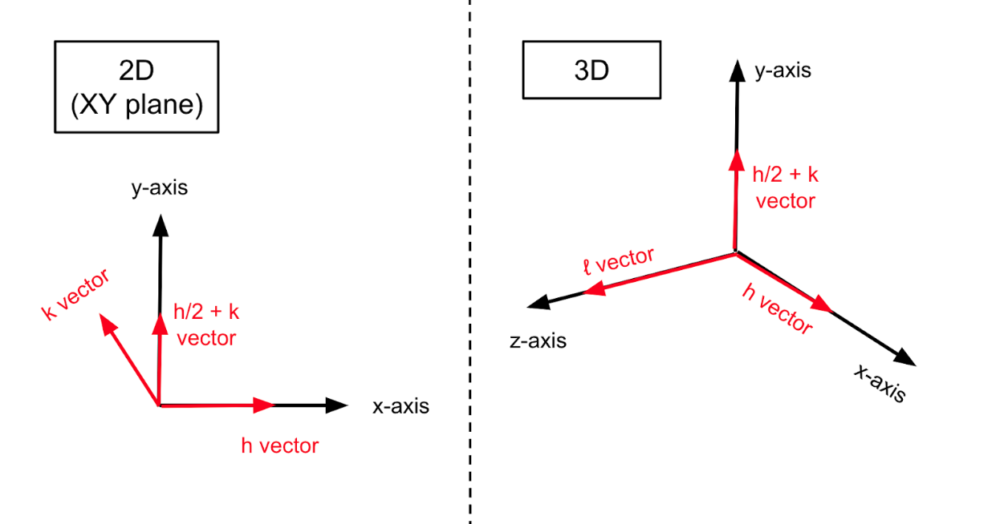

# Graphene-Silicene Bilayer

This tutorial is an introduction to the domain-specific language for prototyping crystal geometries. It shows how the 3D geometry compiler can be used to create 2D shapes. Restriction to 3D shapes was one important design choice for the compiler. By supporting only the minimal amount of needed functionality, the language is simpler and the compiler takes less effort to develop. If the user wishes to work with an unsupported crystal geometry, they can often generate it from a supported geometry. In this case, an unsupported "planar" lattice is created from a "hexagonal" lattice.

Objective: reproduce the graphene-silicene bilayer from https://doi.org/10.1103/PhysRevB.88.245408

## Setup

<b>macOS:</b> Download [Xcode](https://developer.apple.com/xcode). Create a new command-line project with Swift as the primary language. Go to <b>File</b> > <b>Add Package Dependencies</b>. Add a dependency with a link to this repo.

<b>Windows:</b> Download [Swift](https://www.swift.org), set up [Visual Studio Code](https://code.visualstudio.com/Download), and install the [Swift extension](https://www.swift.org/documentation/articles/getting-started-with-vscode-swift.html). Create a new package. Add the HDL dependency to the package manifest.

```
TODO: Show an exemplary package manifest.
```

Paste the following into `main.swift`. The code should compile without errors.

```swift
import HDL

func export(_ atoms: [Atom], comment: String = "") -> String {
  var output: String = ""
  output += String(describing: atoms.count)
  output += "\n"
  output += comment
  output += "\n"
  
  for atom in atoms {
    var elementSymbol: String
    switch atom.element {
    case .hydrogen: elementSymbol = "H "
    case .carbon:   elementSymbol = "C "
    case .silicon:  elementSymbol = "Si"
    default: fatalError("Unrecognized element symbol: \(atom.element)")
    }
    output += elementSymbol
    
    let position: SIMD3<Float> = atom.position
    for vectorLane in 0..<3 {
      // Convert the coordinate from nm -> angstrom.
      let coordinate = position[vectorLane] * 10
      output += " "
      output += String(format: "%.3f", coordinate)
    }
    output += "\n"
  }
  return output
}
```

At any time in the tutorial, you can visualize the atoms. The function `export` creates a portable XYZ representation of the geometry. It can be viewed in a variety of visualization programs, such as PyMOL, Vesta, or SAMSON.

## Create Graphene Layer

Start by creating a 3D sheet of hexagonal diamond. It spans 4 unit cells in the `h` direction and 3 unit cells in the `h + 2 * k` direction. The most important dimension is `l`, which controls the depth. Since graphene is atomically thin, we want the smallest possible value for `l`. This value is 1 unit cell.



The `Volume` chops off unused atoms to create a monolayer. To begin, emulate the act of moving from (0, 0, 0) to (0, 0, 0.25) in a CAD program. Then, place a plane whose normal vector equals `l`. Finally, cut the diamond sheet. This leaves a layer two atoms thick.

```swift
let carbonLattice = Lattice<Hexagonal> { h, k, l in
  let h2k = h + 2 * k
  Bounds { 4 * h + 3 * h2k + 1 * l }
  Material { .elemental(.carbon) }
  
  Volume {
    // Move the player position from the origin to (0, 0, 0.25).
    Origin { 0.25 * l }
    
    // Create a plane pointing from the origin to positive 'l'.
    Plane { l }
    
    // Remove all atoms on the positive side of the plane.
    Replace { .empty }
  }
}
print(export(carbonLattice.atoms, comment: "Step 1"))
```

Lonsdaleite and graphene are similar, with a hexagonal arrangement of atoms. However, the layout of atoms is not exactly the same. Graphene is 2D, while lonsdaleite is 3D. The size of the hexagons is also a little different.

In this code segment, you will combine a custom lattice constant from the literature with the default lattice constant used by the compiler.

```swift
var grapheneHexagonScale: Float
do {
  // Convert graphene lattice constant from Å to nm.
  let grapheneConstant: Float = 2.45 / 10
  
  // Retrieve lonsdaleite lattice constant in nm.
  let lonsdaleiteConstant = Constant(.hexagon) { .elemental(.carbon) }
  
  // Each hexagon's current side length is the value of
  // 'lonsdaleiteConstant'. Dividing by this constant, changes the hexagon
  // so its sides are all 1 nm.
  grapheneHexagonScale = 1 / lonsdaleiteConstant
  
  // Multiply by the graphene constant. This second transformation stretches
  // the hexagon, so its sides are all 0.245 nm.
  grapheneHexagonScale *= grapheneConstant
}

var carbons: [Atom] = carbonLattice.atoms
for atomID in carbons.indices {
  // Flatten the sp3 sheet into an sp2 sheet.
  carbons[atomID].position.z = 0
  
  // Resize the hexagon side length, so it matches graphene.
  carbons[atomID].position.x *= grapheneHexagonScale
  carbons[atomID].position.y *= grapheneHexagonScale
}
print(export(carbons, comment: "Step 2"))
```

## Create Silicene Layer

We will repeat the previous steps for silicene. Silicon atoms are larger than carbon atoms, so the silicene unit cell is larger than the graphene unit cell. To keep the sheets roughly equal in size, use less unit cells for silicon. Notice how the `Bounds` for the code section below is different than the section for graphene.

```swift
let siliconLattice = Lattice<Hexagonal> { h, k, l in
  let h2k = h + 2 * k
  Bounds { 3 * h + 2 * h2k + 1 * l }
  Material { .elemental(.silicon) }
  
  Volume {
    Origin { 0.25 * l }
    Plane { l }
    Replace { .empty }
  }
}
print(export(siliconLattice.atoms, comment: "Step 3"))
```

Change the silicene atoms to match the lattice spacings from the literature. Unlike graphene, silicene atoms are arranged in a 3D manner. Every other silicon atom is elevated in the `l` direction. We will use the $\sqrt{3}/\sqrt{7}$ arrangement from the research paper.

```swift
var siliceneHexagonScale: Float
do {
  // Convert silicene lattice constant from Å to nm.
  let siliceneConstant: Float = 3.75 / 10
  
  // Retrieve the constant for 3D lonsdaleite-shaped silicon, in nm.
  let lonsdaleiteConstant = Constant(.hexagon) { .elemental(.silicon) }
  
  // Create a number that maps from 3D lattice spacing to silicene
  // lattice spacing.
  siliceneHexagonScale = siliceneConstant / lonsdaleiteConstant
}

var silicons: [Atom] = siliconLattice.atoms
for atomID in silicons.indices {
  // Partially flatten the sp3 sheet, so the elevated atoms reach the
  // buckling distance from the literature.
  if silicons[atomID].position.z > 0 {
    silicons[atomID].position.z = 0.62 / 10
  }
  
  // Resize the hexagon side length, so it matches silicene.
  silicons[atomID].position.x *= siliceneHexagonScale
  silicons[atomID].position.y *= siliceneHexagonScale
}
print(export(silicons, comment: "Step 4"))
```

## Create Bilayer

Add the following dependency to your project's package manifest. Then, add `import QuaternionModule` to the top of the Swift file.

```swift
// Dependency
.package(
  url: "https://github.com/philipturner/swift-numerics", 
  branch: "Quaternions"),

// Example of adding the dependency to a package.
let package = Package(
  name: ...,
  products: ...,
  dependencies: [
    .package(
      url: "https://github.com/philipturner/swift-numerics", 
      branch: "Quaternions"),
  ],
  targets: ...
)
```

Finally, combine the graphene and silicene layers into a bilayer. The silicene layer is elevated 3.3 Å above the graphene layer. It is also twisted by 10.9°.

```swift
var rotation: Quaternion<Float>
do {
  // Convert the angle from degrees to radians.
  let angle: Float = 10.9 * .pi / 180
  
  // Create a counterclockwise rotation around the Z axis.
  rotation = Quaternion(angle: angle, axis: [0, 0, 1])
}

for atomID in silicons.indices {
  // Elevate the silicon atom 3.3 Å in the Z direction.
  silicons[atomID].position.z += 3.3 / 10
  
  // Rotate the silicon atom 10.9° about the origin.
  silicons[atomID].position = rotation.act(on: silicons[atomID].position)
}
print(export(carbons + silicons, comment: "Step 5"))
```
